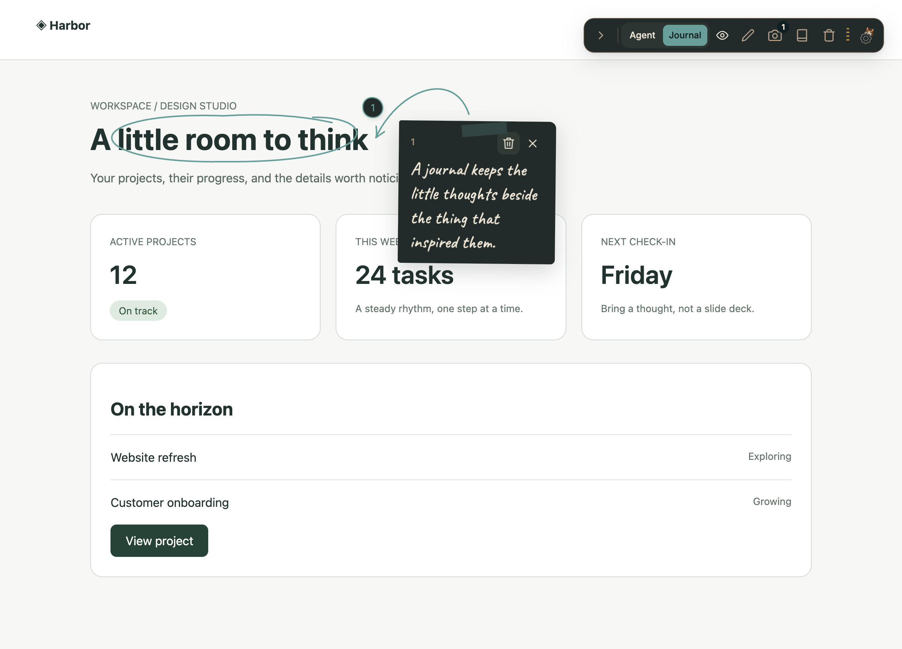

# Use Journal mode

Journal mode leaves personal thoughts and explanations directly on a page. Named journals contain text notes displayed as taped paper, with hand-drawn circles and curved arrows connecting them to the selected elements. Journal notes stay on this device and never enter the Agent Queue or MCP server.

Install the [Waypoint extension](https://chromewebstore.google.com/detail/logbook-waypoint/fgondknhkpekdhbbkgodokmpnpadfedo), enable it on your page, and choose Journal. No local server or coding agent is required.

The screenshot shows the actual extension on a sample page. The [website Journal guide](https://waypoint.logbookfordevs.com/docs/journal-mode) also annotates its own paragraphs with taped margin notes, circles, and arrows.

## Start a journal

1. Open an enabled page and choose **Journal** in the toolbar's Agent / Journal switch. Switching mode does not open a menu.
2. Choose the pen. If the page has no journal, Waypoint creates one with a playful name automatically.
3. Hover an element and click it, or press **Enter** to select the highlighted element. Selection blocks the page's normal click action. Left and right arrow keys adjust the selection scope.
4. Write your note on the taped paper. Use the save checkmark or **Cmd/Ctrl+Enter**. Plain Enter inserts a new line in the editor.

The separate **Journals** icon opens the active-journal picker, creation form, and note list. You can create multiple named journals for the same page and view one at a time. Switching back to Journal restores the current page's selected journal when available.

## Arrange and edit notes

Saved notes are all open together while the journal is visible. Waypoint draws the highlights and arrows automatically; there is no drawing tool. Small text receives a tighter highlight, while cards and larger sections retain their container bounds.

Double-click a note's text to edit it in place. Keyboard users can focus the text and press Enter or Space. Save with the checkmark or Cmd/Ctrl+Enter; closing the editor cancels the edit, with confirmation for unsaved changes.

Drag a note by its tape or header to reposition it. Releasing it regenerates the arrow. Manual positions last for the current page session; refreshing restores automatic placement. Dense layouts may use a scrollable column so notes remain reachable.

Use the eye control to hide or show the **whole journal**, including its notes, pins, and drawings. The close control on a saved note also hides the journal. Hiding does not delete anything.

## Which page owns a journal?

The original URL is saved, but journal matching uses a normalized URL. The origin, path, pagination such as `page`, and unknown query parameters remain significant. Query keys are sorted for matching.

The current exceptions are `sort`, `sortBy`, `sortOrder`, `utm_source`, `utm_medium`, `utm_campaign`, `utm_term`, `utm_content`, `gclid`, and `fbclid`. Ordinary section fragments are ignored; hash routes beginning with `#/` or `#!/` remain significant. These rules apply to journals, not Agent Annotation identity.

If the page changes and a target cannot be found, its pin disappears while the saved note remains in the journal list. Reattach it to another element or delete it. Waypoint does not promise that anchors survive a redesign.

## Copy a screenshot

In Journal mode the camera button copies a **PNG of the visible viewport** to your clipboard. It includes the journal artwork and briefly hides Waypoint's toolbar, menus, and selection controls. It does not capture the full scrolling page. A short shutter sound plays after the image is successfully copied.

If Chrome has not granted capture access to the tab, click the Waypoint extension icon once on that tab, then retry. Clipboard permission failures appear in the Journal panel; allow clipboard access and retry. Image copying requires browser clipboard support on a secure page, such as HTTPS or localhost. Controls return after a failed attempt, and notes stay intact.

Agent mode continues to copy Annotation text. Its Clear on copy preference does not clear Journal notes after a screenshot. A copied image remains in your system clipboard and can be pasted into another application at your discretion.

## Delete notes and manage storage

- A note's trash icon deletes that note.
- The toolbar trash action clears notes from the current journal, retaining the journal itself.
- Deleting a journal removes that collection and its notes after confirmation.
- **Journal storage** opens **Data & Storage → Journal**, where you can review journals across pages.
- **Clear all Journal data** confirms the number of journals and notes before deleting all Journal data on this device. Agent data stays untouched. The Agent tab has its own maintenance controls.

Journal data lives in Chrome's local extension storage. Removing that storage or uninstalling the extension can remove your journals. Phase 1 has no Journal import/export, cross-device sync, agent authoring, shared links, media attachments, Markdown rendering, or guided walkthroughs. Screenshot copying is a local sharing aid, not a hosted journal.
