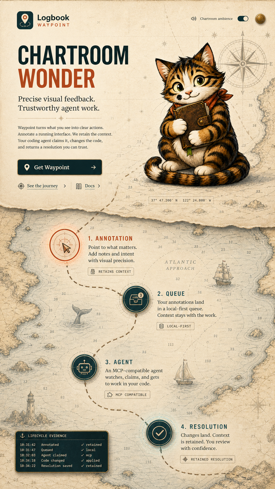

# Waypoint Storybook Chart

> **Production continuity:** This image predates the approved hero-first **Ink Route** transition. Treat it as art-direction evidence only. The canonical stage, greenlights, and approved boundary live in the [Director's Notebook](../../specs/waypoint-ink-route/production/director-notebook.md) and [approved treatment](../../specs/waypoint-ink-route/production/treatment.md).

This generated concept is the visual reference for the **Living Storybook Chart** direction explored for the Logbook Waypoint homepage.

Use it as art-direction evidence rather than a pixel-exact implementation target. The intended production sequence begins with a nearly empty vellum sheet, draws the chart and dashed route in ink, reveals the hero, and then extends the route through Annotation, Queue, Agent, and Resolution as the visitor scrolls. Color, ocean texture, and illustrative detail accumulate gradually along the journey.

The production direction preserves Waypoint's identity and typography while favoring gentle storybook pacing, immediate product clarity, native scrolling, and complete reduced-motion and soundless paths.
